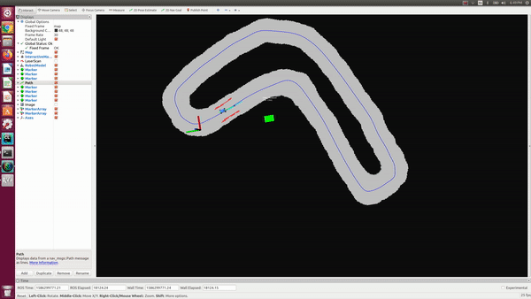
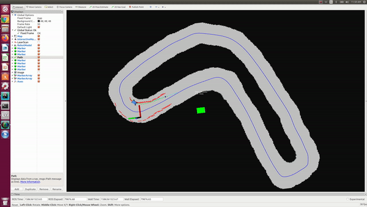
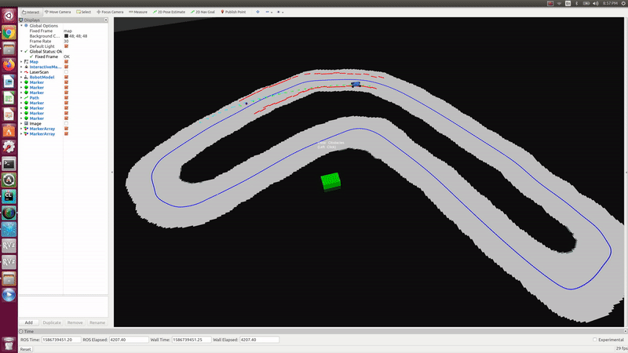
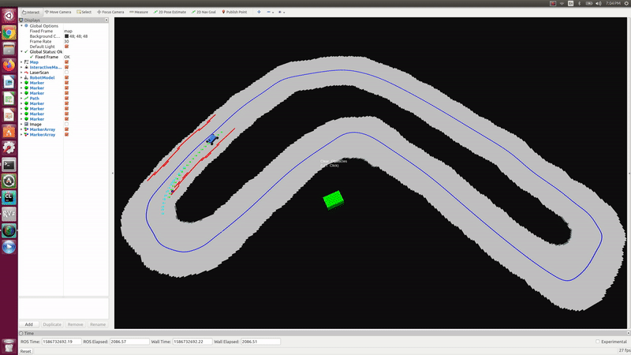
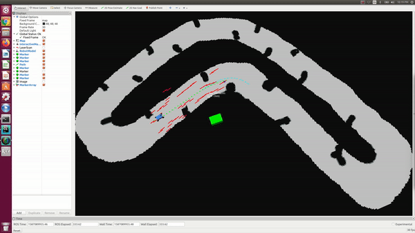
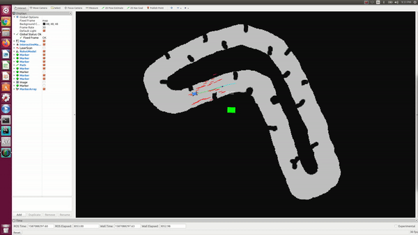

# LearningMPC
Learning based Model Prodictive Control for online iterative trajectory optimization for F1/10 autonomous racing.

The car is learning to improve its racing performance iteratively over laps. 

Initial Sample Safe Set is collected using a path following controller. Starting from Lap 3, control policies are generated by learning MPC. The MPC enforces the terminal state to land within a convex hull of a selected subset of samples. The sample safe set continously grows as more and more data is being collected along the way. The improvement of racing performance over laps is shown here below.

  

Lap 5 (Top speed 1.2 m/s)

Lap 25 (Top speed 3 m/s)

After Lap 60, it converges to an optimal policy (Top speed 6 m/s) with precisely controlled high speed drifting.

.

With low frictions, it converges to a policy with lower top speed but with more drifting.

.

Obstacle Avoidance 1:

.

Obstacle Avoidance 2 (low friction): 

.

Currently working on Gaussian Process and local linear regression for system identification to update the dynamic model online.   

